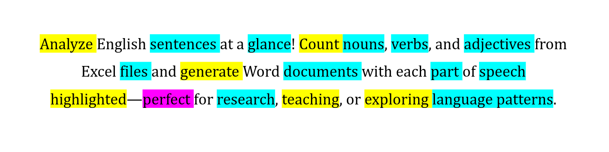

# worlde



**Worlde** is a powerful NLP-based text analysis tool that extracts and counts parts of speech (nouns, verbs, and adjectives) from sentences, with support for highlighted document generation.

## ✨ Features

- 📊 **POS Word Counting**: Extract and count nouns, verbs, and adjectives from sentences
- 🎨 **Highlighted Documents**: Generate DOCX files with color-coded POS highlighting
- 🔄 **Multiple spaCy Models**: Choose from different model sizes for accuracy vs. speed
- 📝 **Structured Excel Output**: Alphabetically organized word counts by POS category
- 🎯 **Lemmatization**: Automatic word normalization (plural→singular, conjugations→infinitive)
- 🚫 **Stop Word Filtering**: Removes common words for cleaner results
- 💪 **Type-Safe**: Full type annotations with mypy validation
- 🎁 **Functional Error Handling**: Clean Result pattern for robust error management

## 📋 Technical Task

**(English version)**

The task is to divide all words (lexemes) into three main
groups: nouns, verbs, and adjectives.

For nouns: singular and plural forms are considered one lexeme.
For adjectives: all degrees of comparison are combined into one lexeme.
For verbs: all tense, person, and aspect forms are counted as one lexeme.

You also need to count the number of occurrences for each lexeme within its
group.

**(Ukrainian version)**

Завдання полягає в тому, щоб розподілити всі слова (лексеми) на три основні
групи: іменники, дієслова та прикметники.

Для іменників: форми однини та множини вважаються однією лексемою.
Для прикметників: усі ступені порівняння об'єднуються в одну лексему.
Для дієслів: усі часові, особові та видові форми рахуються як одна лексема.

Потрібно також порахувати кількість слововживань для кожної лексеми в межах її
групи.

## 🤖 spaCy Models

Worlde supports multiple spaCy English models. Choose based on your needs:

| Model | Size | Speed | Accuracy | Use Case |
|-------|------|-------|----------|----------|
| `spacy-sm` | 12 MB | ⚡⚡⚡ Fast | Good | Quick analysis |
| `spacy-md` | 31 MB | ⚡⚡ Medium | Better | Balanced accuracy/speed |
| `spacy-lg` | 382 MB | ⚡ Slower | Best | High accuracy needed |
| `spacy-trf` | 436 MB | 🐌 Slowest | Excellent | Maximum accuracy |

## 🚀 Installation

### Prerequisites

- Python 3.13+
- [uv](https://github.com/astral-sh/uv) package manager

### Setup

1. **Clone the repository**:

2. **Install dependencies** using `uv` and specify the spaCy model (from the
   table above):

```bash
uv sync --extra <spacy_model>
```

To switch to a different model, you can use run the previous command, with a
new model specified

## 📖 Usage

Worlde provides two main commands: `count` for word counting and `highlight` for document highlighting.

### Command: `count`

Count and export POS-tagged words to Excel.

**Basic usage**:
```bash
uv run python -m app.main count data.xlsx
```

**With options**:
```bash
# Specify sheet name
uv run python -m app.main count data.xlsx --sheet-name sentences

# Use a different spaCy model
uv run python -m app.main count data.xlsx --model-prefix lg

# Custom output sheet name
uv run python -m app.main count data.xlsx --output-sheet analysis
```

**Output**: Creates a formatted Excel sheet with alphabetically organized word counts.

### Command: `highlight`

Generate a DOCX file with POS-highlighted text.

**Basic usage**:
```bash
uv run python -m app.main highlight data.xlsx output.docx
```

**With options**:
```bash
# Specify sheet and model
uv run python -m app.main highlight data.xlsx highlighted.docx --sheet-name sentences --model-prefix md
```

**Output**: DOCX file with:
- Each sentence as a separate paragraph
- **Nouns** highlighted in turquoise
- **Verbs** highlighted in yellow
- **Adjectives** highlighted in pink

### 📊 Input Format

Excel file requirements:
- **One column** with sentences (no headers)
- **One sentence per row**
- Default reads from first sheet or sheet named "data"

### 📤 Output Formats

#### Excel Output (count command)

```
|   | Nouns       |        | Verbs     |        | Adjectives  |        |
|---|-------------|--------|-----------|--------|-------------|--------|
| A | adjective   | 1      |           |        |             |        |
| n |             |        | analyze   | 1      |             |        |
| C | count       | 1      |           |        |             |        |
| D | document    | 1      |           |        |             |        |
| E |             |        |           |        | english     | 1      |
| x |             |        | explore   | 1      |             |        |
| F | file        | 1      |           |        |             |        |
| G |             |        | generate  | 1      |             |        |
| l | glance      | 1      |           |        |             |        |
| H |             |        | highlight | 1      |             |        |
| L | language    | 1      |           |        |             |        |
| N | noun        | 1      |           |        |             |        |
| P | pattern     | 1      |           |        |             |        |
| e |             |        |           |        | perfect     | 1      |
| R | research    | 1      |           |        |             |        |
| S | sentence    | 1      |           |        |             |        |
| p | speech      | 1      |           |        |             |        |
| T | teaching    | 1      |           |        |             |        |
| V | verb        | 1      |           |        |             |        |
```

**Data Structure:**
- **Column 1**: Letter navigation (first letter uppercase, then second letter lowercase)
- **Columns 2-3**: Noun word and count
- **Columns 4-5**: Verb word and count
- **Columns 6-7**: Adjective word and count

Words are grouped alphabetically by first and second letters, with all POS categories in the same row.

#### DOCX Output (highlight command)

- One paragraph per sentence
- Color-coded background highlighting:
  - 🔵 **Turquoise**: Nouns
  - 🟡 **Yellow**: Verbs
  - 🟣 **Pink**: Adjectives
- Fully editable in Microsoft Word or compatible software

## 🛠️ Development

### Project Structure

```
worlde/
├── app/
│   ├── main.py           # CLI entry point with typer commands
│   ├── reader.py         # Excel file reading with Result pattern
│   ├── pos_counter.py    # POS word counting and lemmatization
│   ├── tokenizer.py      # Sentence tokenization with POS tagging
│   ├── docx_writer.py    # DOCX generation with highlighting
│   └── writer.py         # Excel output formatting
├── docs/
│   └── pitch.png         # Project banner
├── pyproject.toml        # Project configuration and dependencies
└── README.md
```

### Code Quality

**Run linters**:
```bash
# Check code style
uv run ruff check app/

# Type checking
uv run mypy app/

# Auto-format code
uv run ruff format app/
```

**Run all checks**:
```bash
uv run ruff check app/ && uv run mypy app/
```

### Architecture Highlights

- **Result Pattern**: All modules return `Result[T, str]` for clean error handling
- **DataFrame-Based**: Uses pandas DataFrames for efficient data manipulation
- **Type-Safe**: Full type annotations verified by mypy
- **Functional**: Minimal side effects, pure functions where possible
- **Modular**: Clear separation of concerns (reading, processing, writing)

## 🎯 Examples

### Example 1: Quick Analysis
```bash
# Analyze with default settings (small model, fast)
uv run python -m app.main count sentences.xlsx
```

### Example 2: High Accuracy Analysis
```bash
# Use transformer model for maximum accuracy
uv run python -m app.main count sentences.xlsx --model-prefix trf --output-sheet detailed_analysis
```

### Example 3: Create Highlighted Document
```bash
# Generate color-coded DOCX for review
uv run python -m app.main highlight sentences.xlsx review.docx --model-prefix md
```

### Example 4: Batch Processing
```bash
# Process multiple files
for file in data/*.xlsx; do
    uv run python -m app.main count "$file" --model-prefix sm
done
```

## ⚠️ Error Handling

Worlde provides clear, colored error messages:

```bash
# Missing file
Error: File not found: missing.xlsx

# Missing sheet
Error: Could not read sheet 'wrong_name': Worksheet named 'wrong_name' not found

# Missing model
Error: Model 'en_core_web_lg' not found. Please install it using: python -m spacy download en_core_web_lg
```

All errors are displayed in red with actionable instructions.

## 📄 License

MIT License

## 🤝 Contributing

Contributions are welcome! Please ensure all code passes linting and type checks before submitting.

```bash
uv run ruff check app/ && uv run mypy app/
```
